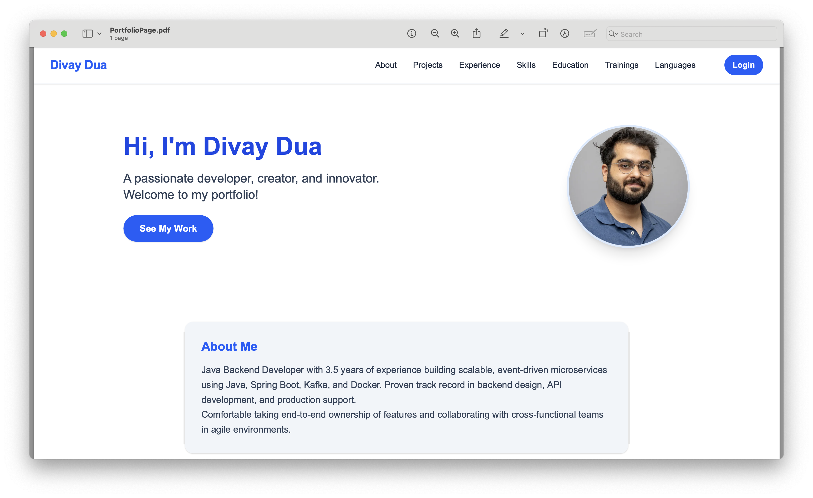

# 🚀 Divay Dua's Portfolio

A modern, fully-editable portfolio website built with Next.js, React, and Tailwind CSS. Showcase your resume, projects, experience, skills, education, trainings, and languages in a beautiful, recruiter-friendly UI. All data is editable from the UI and persists in your browser using localStorage.

---

## ✨ Features
- **Modern, Responsive Design**: Glassmorphism-inspired cards, icons, and a clean blue-accented palette.
- **Editable Sections**: Update About, Projects, Experience, Skills, Education, Trainings, and Languages directly from the UI.
- **Admin Mode**: Simple password-protected login to enable editing (password: `Divaydua@12`).
- **Persistence**: All data is saved in your browser's localStorage—no backend required.
- **Contact & Social**: Customizable email, phone, and social links (GitHub, LinkedIn, XING) with icons.
- **Mobile Friendly**: Looks great on all devices.

---

## 🛠️ Tech Stack
- **Framework**: [Next.js 15 (App Router)](https://nextjs.org/)
- **Frontend**: [React 18+](https://react.dev/), [Tailwind CSS](https://tailwindcss.com/)
- **State & Persistence**: React state + localStorage
- **Icons**: Inline SVGs for all section headers, actions, and social links
- **Authentication**: Simple password-based admin mode (no backend)

---

## 📄 Portfolio Sections
- **About Me**: Name, bio, and profile image
- **Projects**: Title, description, link, image, tech stack
- **Experience**: Title, company, location, dates, description
- **Skills**: Name and proficiency
- **Education**: School, degree, field, dates, description
- **Trainings & Certificates**: Name, issuer, dates, credential URL
- **Languages**: Name and proficiency
- **Contact**: Email, phone, GitHub, LinkedIn, XING

---

## 🔒 Editing & Admin Mode
- Click **Login** (top right) and enter the password (`Divaydua@12`) to enable editing.
- All sections become editable with add/edit/delete buttons and modals.
- Data is saved to your browser's localStorage and persists across refreshes and restarts.

---

## 🚀 Getting Started

1. **Install dependencies:**
   ```bash
   npm install
   ```
2. **Run the development server:**
   ```bash
   npm run dev
   ```
   Open [http://localhost:3000](http://localhost:3000) in your browser.

---

## 🌍 Deployment
- **Recommended:** [Vercel](https://vercel.com/) (free, seamless for Next.js)
- Push your code to GitHub, import to Vercel, and deploy in minutes.
- See [Vercel Docs](https://vercel.com/docs) for details.

---

## ⚠️ Notes
- **Persistence:** Data is stored in your browser only. Clearing browser storage or using a different device/browser will reset the portfolio.
- **No backend/database required.**
- **Password is hardcoded for demo purposes.**

---

## 📸 Preview


---

## 🙏 Credits
- Built by Divay Dua with Next.js, React, and Tailwind CSS.
- Inspired by modern portfolio and glassmorphism UI trends.
# Portfolio Update Sat Aug  9 13:55:13 CEST 2025
